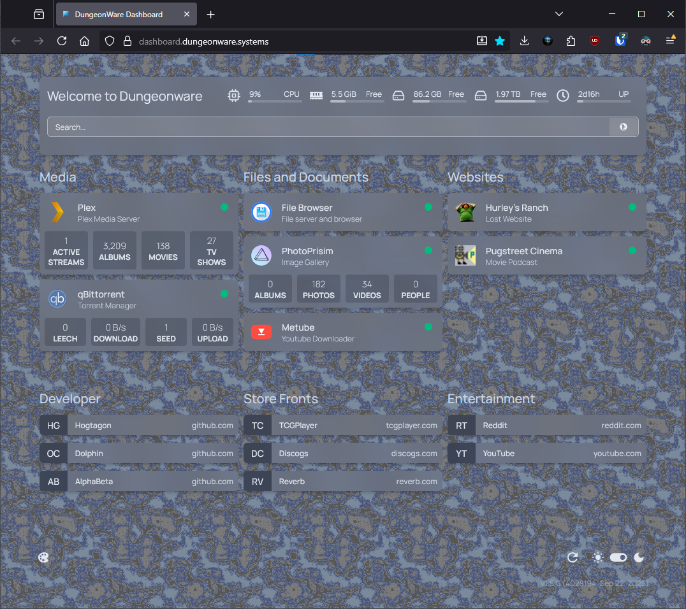

# Welcome to the Dungeonware Homelab

This is my personal homelab project to help maintain and access all of my media.

## Features:
- Runs on **Raspberry Pi 4**
- All servies run in a [Kubernetes](https://kubernetes.io/) environment.
- Deployments and configuration managed by [ArgoCD](https://argo-cd.readthedocs.io).
- [Sealed-Secrets](https://github.com/bitnami-labs/sealed-secrets) encryption and secret management.
- Public servies are exposed via [Cloudflare Tunnels](https://developers.cloudflare.com/cloudflare-one/connections/connect-networks/)
- Monitoring and Usage dashbaords using [Prometheus](https://prometheus.io/) & [Grafana](https://grafana.com/)

## Repo Structure:

```
homelab/
├── apps/                        # Service manifests
│
├── argocd/                      # GitOps configuration
│   ├── applications/            # Individual app definitions
│   └── homelab.yaml             # Root application
│
└── infrastructure/              # Core infrastructure
    ├── cloudflared/             # Cloudflare tunnel
    ├── namespace.yaml           # Homelab namespace
    └── persistent-volumes.yaml  # Storage configuration
```


